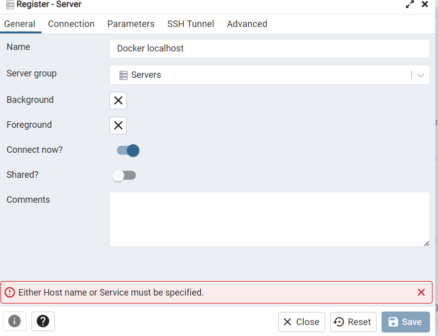

## Pasos de Ejecución:

> 1. Crear la imagen de ingesta de datos 
``` docker
docker build -t taxi_ingest:v001 .
```
> 2. Ejecutar archivo docker-compose
``` docker
docker-compose up -d
```
> 3. Realizar conexión entre contenedores pgdatabase y pgadmin

Estos se conectan mediante la network `01_docker_sql_pg-network` creada en el docker-compose

Se ingresa al pgadmin con sus credenciales creadas en docker-compose


Luego se configura la conexion




> 4. Ahora ejecutamos el contenedor de la imagen creada `taxi_ingest:v001`, para que se realice la ingesta de datos a postgres

Establecemos la variable de esta manera en windows, asi como tambien su llamado de la variable en el comando docker
``` bash
set URL=https://github.com/DataTalksClub/nyc-tlc-data/releases/download/yellow/yellow_tripdata_2021-01.csv.gz
```

``` docker
docker run -it --network=01_docker_sql_pg-network taxi_ingest:v001 --user=root --password=root --host=pgdatabase --port=5432 --db=ny_taxi --table_name=yellow_taxi_trips --url="%URL%"
```

Mostrandose luego los datos insertados:


